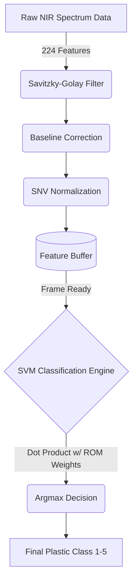

# UART Co-Processing Version User Manual
## EDGE Artix-7 (XC7A100T)

This folder contains a complete, self-contained implementation of the NIR Plastic Sorter Machine Learning pipeline. This specific version is designed for **Live PC Co-Processing**. It uses the Artix-7's onboard USB-UART bridge to receive raw spectra from a Python script and stream real-time classification results back to your computer screen.

### Hardware Architecture Data Flow



---

### Step 1: Vivado Project Setup
1. Open **Vivado 2025.2** (or any modern version) and click **Create Project**.
2. Name your project and select the **RTL Project** type.
3. In the "Add Sources" screen, click **Add Files**, navigate to the `src/` directory in this folder, and select **ALL** `.v`, `.xdc`, and `.hex` files.
4. Set the Default Part to your specific Artix-7 chip (e.g., `xc7a100t...`).
5. Once the project opens, ensure `edge_artix7_uart_top.v` is set as the Top Module.

### Step 2: Generate the Clocking Wizard IP
Because the Artix-7 board has a 50 MHz crystal but our logic runs at 100 MHz, we must generate a clock multiplier.
1. Open the **IP Catalog** and search for **Clocking Wizard**.
2. Double-click it and configure the following:
   * **Component Name:** `clk_wiz_0`
   * **Tab 2 - Input Clocks:** Set Primary `clk_in1` Frequency to **50.000 MHz**.
   * **Tab 3 - Output Clocks:** Set `clk_out1` Requested Frequency to **100.000 MHz**.
   * Ensure `reset` and `locked` are checked at the bottom.
3. Click **OK** -> **Generate**.

### Step 3: Generate Bitstream
1. Click **Generate Bitstream** in the bottom left corner. 
2. Wait for Synthesis, Implementation, and Bitstream generation to complete.
3. Plug your EDGE Artix-7 board into your PC using your primary micro-USB cable and turn it on.
4. Click **Open Hardware Manager** -> **Auto Connect**.
5. Right-click the `xc7a...` device, select **Program Device**, and program it.

---

### Step 4: Run the Python Software
The FPGA is now running! It is waiting for data over the USB cable.

1. Open **Device Manager** on Windows and check the "Ports (COM & LPT)" section to see which `COM` port your USB Serial Port is on (e.g., `COM3`).
2. Navigate to the `software/` folder provided in this release.
3. Open `uart_demo.py` in a text editor (like VS Code or Notepad).
4. Change the line `COM_PORT = 'COMx'` to match your actual COM port.
5. Open your terminal or command prompt in the `software/` folder and run:
   ```bash
   python uart_demo.py
   ```
6. The Python script will read the local `SpectrumData_2021Y-testSetLowNoise.csv` dataset, stream the spectra to the FPGA, and print the FPGA's real-time physical AI classifications on your screen!
