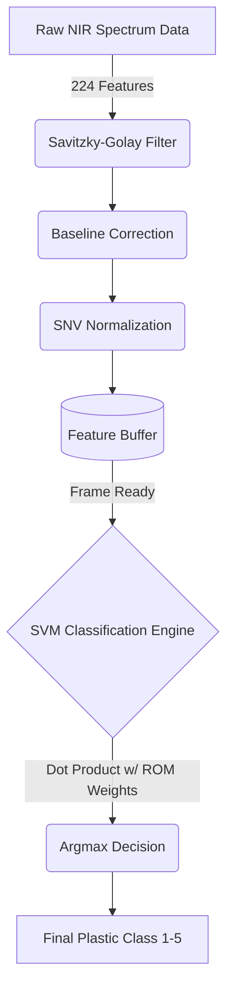

# VIO Standalone Hardware Version User Manual
## EDGE Artix-7 (XC7A100T)

This folder contains a complete, self-contained implementation of the NIR Plastic Sorter Machine Learning pipeline. This specific version is designed for **Standalone Pure-Hardware Testing**. It requires zero external software, python scripts, or serial connections. The test spectra are physically synthesized into the FPGA's internal Block RAM (BRAM), and you interact with the AI pipeline using Vivado's Virtual Input/Output (VIO) dashboard over the JTAG programming cable.

### Hardware Architecture Data Flow

---

### Step 1: Vivado Project Setup
1. Open **Vivado 2025.2** (or any modern version) and click **Create Project**.
2. Name your project and select the **RTL Project** type.
3. In the "Add Sources" screen, click **Add Files**, navigate to the `src/` directory in this folder, and select **ALL** `.v`, `.xdc`, and `.hex` files.
4. Set the Default Part to your specific Artix-7 chip (e.g., `xc7a100t...`).
5. Once the project opens, ensure `edge_artix7_vio_top.v` is set as the Top Module.

---

### Step 2: Choosing Your Dataset
The `src/` folder comes pre-loaded with sets of HEX files representing both Low Noise and High Noise datasets. The Verilog code is permanently looking for files named exactly `test_200_features.hex` and `test_200_classes.hex`.

**To test the Low Noise Dataset:**
1. In the `src/` folder, copy `test_200_low_features.hex` and rename the copy to `test_200_features.hex`.
2. Copy `test_200_low_classes.hex` and rename the copy to `test_200_classes.hex`.

**To test the High Noise Dataset:**
1. Simply copy the two `test_200_high_...` files and rename the copies to the base names, replacing the old ones.

*(Note: We have also provided the Python script `extract_pure_sets.py` in the `python_utils/` folder if you ever want to regenerate these hex files from the original CSVs).*

---

### Step 3: Generate the Required IP Cores
You must generate two Xilinx IPs for this architecture.

**1. Clocking Wizard (`clk_wiz_0`)**
1. Open the **IP Catalog** and search for **Clocking Wizard**.
2. Double-click it and configure:
   * Component Name: `clk_wiz_0`
   * Tab 2 (Input Clocks): Primary `clk_in1` Frequency to **50.000 MHz**.
   * Tab 3 (Output Clocks): `clk_out1` Requested Frequency to **100.000 MHz**.
   * Ensure `reset` and `locked` are checked.
3. Click OK -> Generate.

**2. Virtual Input/Output (`vio_0`)**
1. Open the **IP Catalog** and search for **VIO**.
2. Double-click it and configure:
   * Component Name: `vio_0`
   * Tab 1 (General Options): Input Probe Count = **4**, Output Probe Count = **1**.
   * Tab 2 (PROBE_IN Ports): 
     * PROBE_IN0 Width = **1**
     * PROBE_IN1 Width = **8**
     * PROBE_IN2 Width = **8**
     * PROBE_IN3 Width = **7**
   * Tab 3 (PROBE_OUT Ports):
     * PROBE_OUT0 Width = **1** (Initial Value: `0x0`)
3. Click OK -> Generate.

---

### Step 4: Generate Bitstream & Run the Test
1. Click **Generate Bitstream** in the bottom left corner.
2. Once complete, plug in your Artix-7 board and turn it on.
3. Click **Open Hardware Manager** -> **Auto Connect**.
4. Right-click your device and click **Program Device**.

**Using the VIO Dashboard:**
1. As soon as programming finishes, the `hw_vios` dashboard will pop up.
2. Click the `+` (Add Probes) button at the top of the dashboard.
3. Hold `CTRL` and select all the full-bus signals (the ones with `[X:0]` in the name) and click OK.
4. Right-click the hex values (`[H] 00`) under the Value column, select **Radix**, and change them to **Unsigned Decimal**.
5. Right-click the value for `vio_start` (`probe_out0`), go to **VIO Value Mode**, and change it to **Toggle**.
6. **Click the Toggle button to change it to `1`!**

The FPGA will instantly run all 200 spectra at 100 MHz. The `test_done` signal will flip to 1, and the `accuracy_pct` probe will display your final system accuracy.
